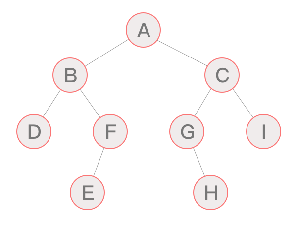

# 算法与数据结构

## 算法

  1. 输入性
  2. 输出性
  3. 确定性
  4. 有穷性
  5. 可行性

### 算法效率：

#### 1 时间复杂度
执行次数 = n^2 + 2*n + 10 

数量级
趋势

一个算法语句总的执行次数是关于问题规模N的问题
N 为问题的规模
T（N） 为语句总的执行次数
算法的执行次数的增长速率和f(N)的增长速率相同 T(N)=O(f(n))
O(f(n)) 时间复杂度的O渐进表达法

最坏时间复杂度：
最优时间复杂度：
平均时间复杂度：

时间复杂度关系： O(1) 《 O(logn) <  O(n) < O(nlogn) < O(n^2) < O(n^3) < O(2^n) < O(n!) < O(n^n)
 
#### 2 空间复杂度
运行一个程序需要内存的大小
程序执行的内存： 
    * 固定部分： 指令，常量
    * 可变部分

一个算法所需的存储空间用f(n)表示。 S(n)=O（f(n)）表示空间复杂度
    
### 排序算法 Sort Algorithm

排序算法的特性：
    1. 稳定性： 

#### 冒泡排序 Bubble Sort
> 比较相邻的元素,最大的沉底，最小的最上面
 最坏时间复杂度：O(n^2)
 最优时间复杂度：O(1)

#### 选择排序 Bubble Sort
> 选择最小的一个，放在最前面
 最坏时间复杂度：O(n^2)
 最优时间复杂度：O(n^2)
 稳定性：不稳定

#### 插入排序 Insert Sort
> 通过建立有序部分，和无序的部分 
 最优时间复杂度：O(n)
 最坏时间复杂度：O(n^2)
 稳定性：稳定
 
#### 快速排序/交换排序 Quick Sort
> 1 选择准数（比如第一个元素），比基准数大的放后边，小的放左边
 最优时间复杂度：O(nlogn)
 最坏时间复杂度：O(n^2)
  稳定性：不稳定
 
#### 归并排序
> 先递归分解，再合并数组
 最优时间复杂度：O(nlogn)
 最坏时间复杂度：O(nlogn)
  稳定性：稳定
>
>
[54,26,93,17,77,31,44,55]
分解
[[54],[26],[93],[17],77,31,44,55]
合并 分解
[[26，54],[17，93], [31,77],[44,55]]
 
### 查找算法

#### 顺序查找

#### 二分查找

> 针对已排序的列表

## 数据结构

数据是一个抽象概念，将其进行分类后得到程序设计语言中的基本类型：int，float，char

数据结构指：数据对象中数据元素之间的关系，例如列表，元组，字典 ..
python的扩展数据结构： 堆栈，队列

### 线性表

线性表：某类元素的一个集合

根据存储方式：
    * 顺序表：元素顺序存放在一块连续的存储区里，元素间的顺序关系由存储顺序自然表示
    * 链表： 将元素存在在通过链接结构起来的一系列存储块中

顺序表
> 需要预先直到数据大小来申请连续的存储空间
1. 添加元素
    * 尾端加入元素  O(1)
    * 非保序添加   O(1)
    * 保序添加     O(n)
2. 删除元素   
    * 删除尾部元素      O(1)
    * 非保序的元素删除   O(1)
    * 保序的元素删除     O(n)

链表 
>充分利用内存空间，灵活的内存动态管理
> 在每个结点里存放下一个节点的位置信息 （元素域:存具体数据 + 链接域:下一个数据位置）
 
链表的方法：
    is_empty 是否为空
    length   长度
    travel   遍历
    add      头添加
    append   尾添加
    insert
    remove  删除
    search  查找

#### 单向链表（单链表） 
 
#### 双向链表 : 每个结点，有2个链接域名（前驱，后继）

### 堆栈 栈
> 后进先出。 可以使用顺序表

栈的方法：
    push 栈头添加
    pop  栈头删除
### 队列
> 先进先出，后进后出
    
### 树
> 树状结构的数据，n个有限结点组成的

特定：
   * 每个节点有0个或多个节点
   * 没有父节点的成为根节点
   * 每个非父节点只有一个父节点
   * 每个子节点可以看作一个子树
   
节点的度： 一个节点包含的子节点的度
树的度： 子树的最大的度
叶节点/终节点： 没有度的节点
树的高度/深度：树的层树

树的种类：

* 无序树/有序树

* 有序树：任意节点之间有顺序关系
    
    * 二叉树：每个节点最多包含2个子节点
        * 完全二叉树：除叶节点外，都有2个子结点 （满完全二叉树）
        * 平衡二叉树：任何节点的子树高度差b不大于1
        * 排序二叉树：每个节点的左边小，右边大
        
### 二叉树

> 二叉树的遍历（traversing binary tree）是指从根结点出发，按照某种次序依次访问二叉树中所有的结点，使得每个结点被访问依次且仅被访问一次。

* 广度优先遍历
    * 层序遍历 - 从根结点从上往下逐层遍历，在同一层按，从左到右的顺序逐个访问  (遍历结果为：ABCDFGIEH)

* 深度优先遍历
    * 先序/前序遍历 - 先访问根结点，然后前序遍历左节点，然后前序遍历右节点 (遍历结果为：ABDFECGHI)
    * 中序遍历 - 中序遍历根结点的左子树，然后访问根结点，最后遍历右子树 (遍历结果为：DBEFAGHCI)
    * 后序遍历 - 从左到右先叶子后结点的方式遍历左右子树，最后访问根结点  (遍历结果为：DEFBHGICA)
