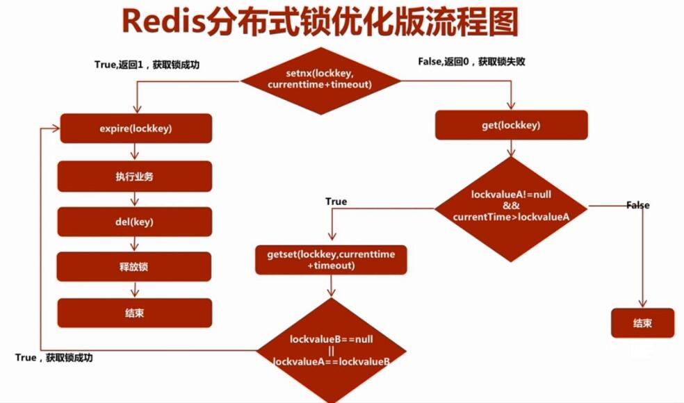

# Redis 锁

## Redis锁机制 

1. 悲观锁(Pessimistic Lock): 不允许自己执行期间有其他操作干扰
    * 共享锁【shared locks】又称:读锁，简称S锁。 多个事务对于同一数据可以共享一把锁，都能访问到数据，但是只能读不能修改。
    * 排他锁【exclusive locks】又称:写锁，简称X锁。 不能与其他锁并存，只有获取排他锁的事务是可以对数据行读取和修改

    Redis不支持悲观锁。Redis作为缓存服务器使用时，以读操作为主，很少写操作，相应的操作被打断的几率较少。不采用悲观锁是为了防止降低性能。
    
2. 乐观锁（Optimistic Locking）: 执行操作前假设当前操作不会被打断,在提交的时候才去锁定。万一发生了其他操作的干扰，那么本次操作将被放弃

3. Redis中的锁策略

    Redis采用了乐观锁策略（通过watch操作）。乐观锁支持读操作，适用于多读少写的情况！
    在事务中，可以通过watch命令来加锁；使用 UNWATCH可以取消加锁；
    如果在事务之前，执行了WATCH（加锁），那么执行EXEC 命令或 DISCARD 命令后，锁对自动释放，即不需要再执行 UNWATCH 了

redis锁工具类
```java

package com.fly.lock;
import redis.clients.jedis.Jedis;
import redis.clients.jedis.JedisPool;
import redis.clients.jedis.JedisPoolConfig;
public class RedisLock {
  //初始化redis池
  private static JedisPoolConfig config;
  private static JedisPool pool;
  static {
    config = new JedisPoolConfig();
    config.setMaxTotal(30);
    config.setMaxIdle(10);
    pool = new JedisPool(config, "192.168.233.200", 6379);
  }
  /**
   * 给target上锁
   * @param target
   **/
  public static void lock(Object target) {
    //获取jedis
    Jedis jedis = pool.getResource();
    //result接收setnx的返回值，初始值为0
    Long result= 0L;
    while (result < 1) {
      //如果target在redis中已经存在，则返回0；否则，在redis中设置target键值对，并返回1
      result = jedis.setnx(target.getClass().getName() + target.hashCode(), Thread.currentThread().getName());
    }
    jedis.close();
  }
  /**
   * 给target解锁
   * @param target
   **/
  public static void unLock(Object target) {
    Jedis jedis = pool.getResource();
    //删除redis中target对象的键值对
    Long del = jedis.del(target.getClass().getName() + target.hashCode());
    jedis.close();
  }
  /**
   * 尝试给target上锁，如果锁成功返回true，如果锁失败返回false
   * @param target
   * @return
   **/
  public static boolean tryLock(Object target) {
    Jedis jedis = pool.getResource();
    Long row = jedis.setnx(target.getClass().getName() + target.hashCode(), "true");
    jedis.close();
    if (row > 0) {
      return true;
    }
    return false;
  }
}

```

测试类
```java
package com.fly.test;
import com.fly.lock.RedisLock;
class Task {
  public void doTask() {
    //上锁
    RedisLock.lock(this);
    System.out.println("当前线程: " + Thread.currentThread().getName());
    System.out.println("开始执行: " + this.hashCode());
    try {
      System.out.println("doing...");
      Thread.sleep(2000);
    } catch (InterruptedException e) {
      e.printStackTrace();
    }
    System.out.println("完成: " + this.hashCode());
    //解锁
    RedisLock.unLock(this);
  }
}
public class Demo {
  public static void main(String[] args) {
    Task task = new Task();
    Thread[] threads = new Thread[5];
    for (Thread thread : threads) {
      thread = new Thread(()->{
        task.doTask();
      });
      thread.start();
    }
  }
}
```

## Redis锁机制的几种实现方式

redis能用的的加锁命令分别是
 *  INCR
 *  SETNX
 *  SET
 
### 第一种锁命令 INCR
这种加锁的思路是， key 不存在，那么 key 的值会先被初始化为 0 ，然后再执行 INCR 操作进行加一。
然后其它用户在执行 INCR 操作进行加一时，如果返回的数大于 1 ，说明这个锁正在被使用当中。

    1、 客户端A请求服务器获取key的值为1表示获取了锁
    2、 客户端B也去请求服务器获取key的值为2表示获取锁失败
    3、 客户端A执行代码完成，删除锁
    4、 客户端B在等待一段时间后在去请求的时候获取key的值为1表示获取锁成功
    5、 客户端B执行代码完成，删除锁

    $redis->incr($key);
    $redis->expire($key, $ttl); //设置生成时间为1秒

### 第二种锁SETNX
这种加锁的思路是，如果 key 不存在，将 key 设置为 value
如果 key 已存在，则 SETNX 不做任何动作

    1、 客户端A请求服务器设置key的值，如果设置成功就表示加锁成功
    2、 客户端B也去请求服务器设置key的值，如果返回失败，那么就代表加锁失败
    3、 客户端A执行代码完成，删除锁
    4、 客户端B在等待一段时间后在去请求设置key的值，设置成功
    5、 客户端B执行代码完成，删除锁

    $redis->setNX($key, $value);
    $redis->expire($key, $ttl);

### 第三种锁SET
上面两种方法都有一个问题，会发现，都需要设置 key 过期。那么为什么要设置key过期呢？如果请求执行因为某些原因意外退出了，导致创建了锁但是没有删除锁，那么这个锁将一直存在，以至于以后缓存再也得不到更新。于是乎我们需要给锁加一个过期时间以防不测。
但是借助 Expire 来设置就不是原子性操作了。所以还可以通过事务来确保原子性，但是还是有些问题，所以官方就引用了另外一个，使用 SET 命令本身已经从版本 2.6.12 开始包含了设置过期时间的功能。

    1、 客户端A请求服务器设置key的值，如果设置成功就表示加锁成功
    2、 客户端B也去请求服务器设置key的值，如果返回失败，那么就代表加锁失败
    3、 客户端A执行代码完成，删除锁
    4、 客户端B在等待一段时间后在去请求设置key的值，设置成功
    5、 客户端B执行代码完成，删除锁

    $redis->set($key, $value, array('nx', 'ex' => $ttl));  //ex表示秒

## 锁的其它问题
 
1. redis发现锁失败了要怎么办？中断请求还是循环请求？
2. 循环请求的话，如果有一个获取了锁，其它的在去获取锁的时候，是不是容易发生抢锁的可能？
3. 锁提前过期后，客户端A还没执行完，然后客户端B获取到了锁，这时候客户端A执行完了，会不会在删锁的时候把B的锁给删掉？

### 解决办法

针对问题1：使用循环请求，循环请求去获取锁
针对问题2：针对第二个问题，在循环请求获取锁的时候，加入睡眠功能，等待几毫秒在执行循环
针对问题3：在加锁的时候存入的key是随机的。这样的话，每次在删除key的时候判断下存入的key里的value和自己存的是否一样
```
        do {  //针对问题1，使用循环
            $timeout = 10;
            $roomid = 10001;
            $key = 'room_lock';
            $value = 'room_'.$roomid;  //分配一个随机的值针对问题3
            $isLock = Redis::set($key, $value, 'ex', $timeout, 'nx');//ex 秒
            if ($isLock) {
                if (Redis::get($key) == $value) {  //防止提前过期，误删其它请求创建的锁
                    //执行内部代码
                    Redis::del($key);
                    continue;//执行成功删除key并跳出循环
                }
            } else {
                usleep(5000); //睡眠，降低抢锁频率，缓解redis压力，针对问题2
            }
        } while(!$isLock);
```

另外一个锁 以上的锁完全满足了需求，但是官方另外还提供了一套加锁的算法 

## Redis 分布式锁

### 一、什么是分布式锁？

* 线程锁
  主要用来给方法、代码块加锁。当某个方法或代码使用锁，在同一时刻仅有一个线程执行该方法或该代码段。
  > JAVA：线程锁只在同一JVM中有效果，因为线程锁的实现在根本上是依靠线程之间共享内存实现的，比如synchronized是共享对象头，显示锁Lock是共享某个变量（state）。

* 进程锁：为了控制同一操作系统中多个进程访问某个共享资源，因为进程具有独立性，各个进程无法访问其他进程的资源。

* 分布式锁：当多个进程不在同一个系统中，用分布式锁控制多个进程对资源的访问

### 二、分布式锁的使用场景

线程间并发问题和进程间并发问题都是可以通过分布式锁解决的，但是强烈不建议这样做！ 因为采用分布式锁解决这些小问题是非常消耗资源的！

分布式锁应该用来解决分布式情况下的多进程并发问题才是最合适的。

有这样一个情境，线程A和线程B都共享某个变量X。

* 如果是单机情况下（单JVM），线程之间共享内存，只要使用线程锁就可以解决并发问题。

* 如果是分布式情况下（多JVM），线程A和线程B很可能不是在同一JVM中，线程锁就无法起到作用了，这时候就要用到分布式锁来解决

### 三、分布式锁的实现（Redis）

分布式锁实现的关键是在分布式的应用服务器外，搭建一个存储服务器，存储锁信息，这时候我们很容易就想到了Redis。

首先我们要搭建一个Redis服务器，用Redis服务器来存储锁信息。

在实现的时候要注意的几个关键点：

1. 锁信息必须是会过期超时的，不能让一个线程长期占有一个锁而导致死锁；

2. 同一时刻只能有一个线程获取到锁。

几个要用到的redis命令：

* setnx(key, value)：“set if not exits”，若该key-value不存在，则成功加入缓存并且返回1，否则返回0。

* get(key)：获得key对应的value值，若不存在则返回nil。

* getset(key, value)：先获取key对应的value值，若不存在则返回nil，然后将旧的value更新为新的value。

* expire(key, seconds)：设置key-value的有效期为seconds秒。



我采用Jedis作为Redis客户端的api，下面来看一下具体实现的代码。

（1）首先要创建一个Redis连接池。

复制代码
public class RedisPool {
 
    private static JedisPool pool;//jedis连接池
 
    private static int maxTotal = 20;//最大连接数
 
    private static int maxIdle = 10;//最大空闲连接数
 
    private static int minIdle = 5;//最小空闲连接数
 
    private static boolean testOnBorrow = true;//在取连接时测试连接的可用性
 
    private static boolean testOnReturn = false;//再还连接时不测试连接的可用性
 
    static {
        initPool();//初始化连接池
    }
 
    public static Jedis getJedis(){
        return pool.getResource();
    }
 
    public static void close(Jedis jedis){
        jedis.close();
    }
 
    private static void initPool(){
        JedisPoolConfig config = new JedisPoolConfig();
        config.setMaxTotal(maxTotal);
        config.setMaxIdle(maxIdle);
        config.setMinIdle(minIdle);
        config.setTestOnBorrow(testOnBorrow);
        config.setTestOnReturn(testOnReturn);
        config.setBlockWhenExhausted(true);
        pool = new JedisPool(config, "127.0.0.1", 6379, 5000, "liqiyao");
    }
}
复制代码
 

（2）对Jedis的api进行封装，封装一些实现分布式锁需要用到的操作。

复制代码
public class RedisPoolUtil {
 
    private RedisPoolUtil(){}
 
    private static RedisPool redisPool;
 
    public static String get(String key){
        Jedis jedis = null;
        String result = null;
        try {
            jedis = RedisPool.getJedis();
            result = jedis.get(key);
        } catch (Exception e){
            e.printStackTrace();
        } finally {
            if (jedis != null) {
                jedis.close();
            }
            return result;
        }
    }
 
    public static Long setnx(String key, String value){
        Jedis jedis = null;
        Long result = null;
        try {
            jedis = RedisPool.getJedis();
            result = jedis.setnx(key, value);
        } catch (Exception e){
            e.printStackTrace();
        } finally {
            if (jedis != null) {
                jedis.close();
            }
            return result;
        }
    }
 
    public static String getSet(String key, String value){
        Jedis jedis = null;
        String result = null;
        try {
            jedis = RedisPool.getJedis();
            result = jedis.getSet(key, value);
        } catch (Exception e){
            e.printStackTrace();
        } finally {
            if (jedis != null) {
                jedis.close();
            }
            return result;
        }
    }
 
    public static Long expire(String key, int seconds){
        Jedis jedis = null;
        Long result = null;
        try {
            jedis = RedisPool.getJedis();
            result = jedis.expire(key, seconds);
        } catch (Exception e){
            e.printStackTrace();
        } finally {
            if (jedis != null) {
                jedis.close();
            }
            return result;
        }
    }
 
    public static Long del(String key){
        Jedis jedis = null;
        Long result = null;
        try {
            jedis = RedisPool.getJedis();
            result = jedis.del(key);
        } catch (Exception e){
            e.printStackTrace();
        } finally {
            if (jedis != null) {
                jedis.close();
            }
            return result;
        }
    }
}
复制代码
 

（3）分布式锁工具类

复制代码
public class DistributedLockUtil {
 
    private DistributedLockUtil(){
    }
 
    public static boolean lock(String lockName){//lockName可以为共享变量名，也可以为方法名，主要是用于模拟锁信息
        System.out.println(Thread.currentThread() + "开始尝试加锁！");
        Long result = RedisPoolUtil.setnx(lockName, String.valueOf(System.currentTimeMillis() + 5000));
        if (result != null && result.intValue() == 1){
            System.out.println(Thread.currentThread() + "加锁成功！");
            RedisPoolUtil.expire(lockName, 5);
            System.out.println(Thread.currentThread() + "执行业务逻辑！");
            RedisPoolUtil.del(lockName);
            return true;
        } else {
            String lockValueA = RedisPoolUtil.get(lockName);
            if (lockValueA != null && Long.parseLong(lockValueA) >= System.currentTimeMillis()){
                String lockValueB = RedisPoolUtil.getSet(lockName, String.valueOf(System.currentTimeMillis() + 5000));
                if (lockValueB == null || lockValueB.equals(lockValueA)){
                    System.out.println(Thread.currentThread() + "加锁成功！");
                    RedisPoolUtil.expire(lockName, 5);
                    System.out.println(Thread.currentThread() + "执行业务逻辑！");
                    RedisPoolUtil.del(lockName);
                    return true;
                } else {
                    return false;
                }
            } else {
                return false;
            }
        }
    }
}
复制代码

## 参考
* [Redis锁机制的几种实现方式](https://www.cnblogs.com/fengff/p/10913492.html)
* [Distributed locks with Redis](https://redis.io/topics/distlock)
* [Redis分布式锁的实现原理](https://mp.weixin.qq.com/s?__biz=MzU0OTk3ODQ3Ng==&mid=2247483893&idx=1&sn=32e7051116ab60e41f72e6c6e29876d9&chksm=fba6e9f6ccd160e0c9fa2ce4ea1051891482a95b1483a63d89d71b15b33afcdc1f2bec17c03c&mpshare=1&scene=1&srcid=0416Kx8ryElbpy4xfrPkSSdB&key=1eff032c36dd9b3716bab5844171cca99a4ea696da85eed0e4b2b7ea5c39a665110b82b4c975d2fd65c396e91f4c7b3e8590c2573c6b8925de0df7daa886be53d793e7f06b2c146270f7c0a5963dd26a&ascene=1&uin=MTg2ODMyMTYxNQ%3D%3D&devicetype=Windows+10&version=62060739&lang=zh_CN&pass_ticket=y1D2AijXbuJ8HCPhyIi0qPdkT0TXqKFYo%2FmW07fgvW%2FXxWFJiJjhjTsnInShv0ap)

* [Redis 分布式锁的作用及实现 ](https://www.cnblogs.com/xiaozengzeng/p/12640947.html)

https://zhuanlan.zhihu.com/p/112016634

https://blog.csdn.net/t8116189520/article/details/91383256

